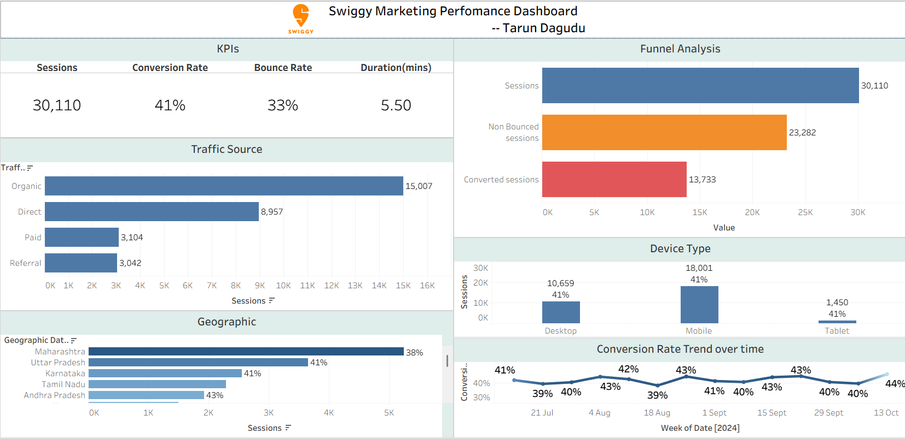

# Swiggy Web Traffic & Conversion Analysis

##  Background
Swiggy is facing a challenge: despite high traffic, conversion rates are lower than expected. This project provides the marketing team with a deep dive into user behavior and traffic patterns to optimize digital strategy and drive revenue growth.

##  Live Interactive Dashboard
 **[View Live Interactive Dashboard](https://public.tableau.com/views/swiggy_17745208732050/Dashboard?:language=en-US&:sid=&:redirect=auth&:display_count=n&:origin=viz_share_link)**

##  Dashboard Preview

##  Project Goals
* **Visualize KPIs:** Track traffic, engagement, and conversion rates.
* **Identify Drivers:** Understand which traffic sources and user segments drive the most conversions.
* **Actionable Insights:** Provide data-driven recommendations to improve website performance.

##  Files
* `swiggy.twbx`: Full Tableau Workbook (includes dataset).
